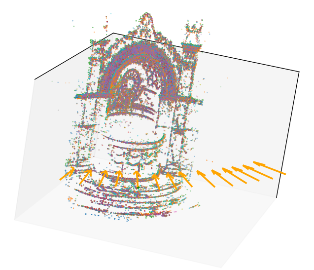

# Structure from motion

A simple structure from motion library. 

TODO:
- Remove hardcoded image data in ImageData and allow user to provide folder path and initial pair for themselves.
- Add function for making the visualized points the same color as in the original image.
- Untangle the files in sfm/ further. The functions should mor clearly belong in their respective file.

## Structure

    SFM/
    │
    ├── image/
    │   ├── exif.py             # Loading exif data
    │   └── image_data.py       # ImagaData holds information about dataset
    │
    ├── scripts/
    │   └── pipeline.py         # Test pipeline
    │
    ├── sfm/
    │   ├── essential.py
    │   ├── misc.py
    │   ├── plotting.py
    │   ├── sift.py
    │   ├── translation.py
    │   └── triangulate.py

## Usage

### Windows:

    py -3.10 -m venv .venv
    .\.venv\Scripts\activate
    pip install -r requirements.txt
    python -m scripts.pipeline

If you get the error message 

    \.venv\Scripts\Activate.ps1 cannot be loaded because running scripts is disabled on this system. For more information, see about_Execution_Policies at
    https:/go.microsoft.com/fwlink/?LinkID=135170.
    At line:1 char:1
    + .\.venv\Scripts\activate

use 

    Set-ExecutionPolicy -Scope Process -ExecutionPolicy Bypass

to allow the current PowerShell session to run scripts.

### Linux/macOS:

    python3.10 -m venv .venv
    source .venv/bin/activate
    pip install -r requirements.txt
    python -m scripts.pipeline
